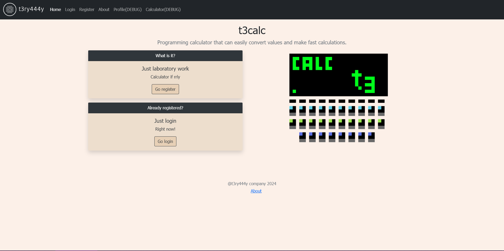

# Лабораторна робота №1 "Web-дизайн"
## Виконав
Терентьєв Іван Дмитрович КВ-11
## Завдання
Розробити статичні Web-сторінки додатку та перевірити коректне їх відображення на екранах різного розміру.
## Тематика додатка
Калькулятор (режим звичайний, для програміста)
## Screenshot

